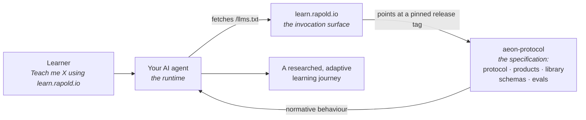
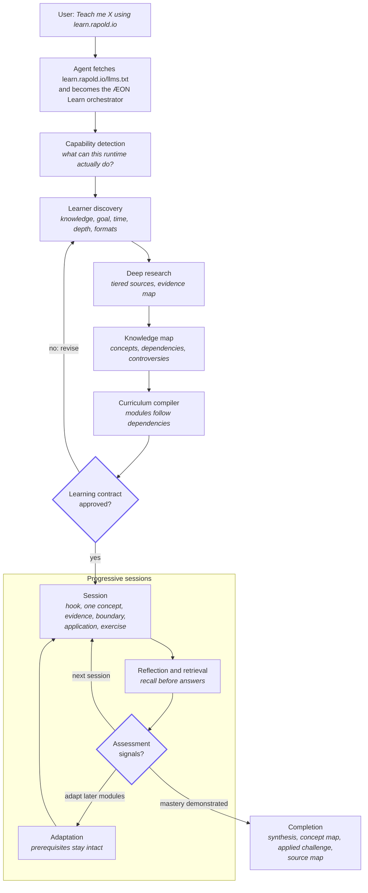

# ÆON Protocol

An open, model-agnostic protocol for agent-orchestrated cognitive workflows: your own AI agent
turns one sentence of intent into a researched, verifiable, progressively executed journey.

[](https://github.com/marcelrapold/aeon-protocol/actions/workflows/docs.yml)
[](https://github.com/marcelrapold/aeon-protocol/actions/workflows/site.yml)
[](https://github.com/marcelrapold/aeon-protocol/releases)
[](LICENSE)
[](protocol/)
[](https://learn.rapold.io)
[](https://github.com/marcelrapold/aeon-protocol/commits/main)

> [!NOTE]
> **Management summary.** ÆON is an open, model-agnostic protocol for agent-orchestrated cognitive
> workflows. It defines how an AI agent turns an ambiguous human intention into a structured,
> researched, verifiable and progressively executed workflow — and it ships no runtime of its own.
> The first official workflow is **ÆON Learn**: you paste one sentence into any capable AI agent
> and it compiles a researched, adaptive learning journey for any subject. Three roles carry the
> whole design: the website is the invocation surface, this repository is the specification, and
> your own agent is the runtime. If you build agents, adopt the specifications; if you want to
> learn something, read the [quickstart](#quickstart).

*Figure 1. The three roles. You invoke the protocol in your own agent; the agent fetches the
bootstrap from the invocation surface, follows the specifications pinned in this repository, and
runs the journey in your session. No account, no backend, no content API.*



---

## Contents

- [Overview](#overview)
- [Quickstart](#quickstart)
- [How it works](#how-it-works)
- [Repository layout](#repository-layout)
- [Components](#components)
- [Documentation map](#documentation-map)
- [The deep-dive library](#the-deep-dive-library)
- [Design principles](#design-principles)
- [Conformance](#conformance)
- [Origin case: the Charisma Sprint](#origin-case-the-charisma-sprint)
- [Versioning and releases](#versioning-and-releases)
- [Contributing](#contributing)
- [Security](#security)
- [License and maintainer](#license-and-maintainer)

---

## Overview

This repository is the specification. It is written for two audiences:

- **Agent builders and implementers** who want a vendor-neutral contract for cognitive workflows,
  with stable requirement identifiers they can test against.
- **Learners and practitioners** who want to run ÆON Learn today in whatever agent they already
  use, without signing up for anything.

**Goals.** Specify observable agent behaviour rather than prose; keep the runtime with the user;
keep every requirement model-agnostic; make conformance testable from a transcript; version the
specification so agents can pin an immutable release.

**Non-goals.** ÆON Learn V1 deliberately excludes user accounts, proprietary backends, payment,
course marketplaces, learning-management features, progress dashboards, native audio hosting,
mobile apps, vector databases and any central learner database. V1 proves the protocol. The full
list is normative in [`products/learn/specification.md`](products/learn/specification.md).

## Quickstart

**Prerequisites:** one AI agent you already use — ChatGPT, Claude, Gemini, a local agent or an
agent framework. An agent that can fetch a URL gets the full workflow; an agent without web access
still runs the protocol but must disclose the limitation and lower its confidence claims
(requirement `LEARN-4`).

1. Open a fresh session in your agent.
2. Send one sentence, naming the subject you want and the invocation surface:

   ```text
   Teach me Austrian Economics using learn.rapold.io
   ```

3. Answer the discovery questions. The agent asks what you already know, what you want to be able
   to do, how much time you have and which formats suit you.
4. Review the learning contract. The agent proposes a dependency-ordered curriculum and waits for
   your approval before teaching anything.
5. Run one session at a time. Each session ends with retrieval practice, and the agent adapts the
   later modules to what you demonstrate.

Swap the subject for anything you like. Any subject works — the [library](#the-deep-dive-library)
accelerates known subjects but never limits the protocol.

> [!IMPORTANT]
> A conforming agent does not answer the invocation with "Lesson 1". It discovers, researches and
> maps first. If your agent starts generating chapters immediately, it is not following the
> protocol — see [`evals/learn/`](evals/learn/) for how that failure is scored.

## How it works

*Figure 2. The ÆON Learn journey: discovery and research run before any content exists, a learning
contract gates teaching, and assessment signals feed back into later modules.*



The website is not the intelligence. It is the protocol entry point. Agents fetch
[`learn.rapold.io/llms.txt`](https://learn.rapold.io/llms.txt), which points at the normative
specifications in this repository, pinned to a release tag — the plain-text form of this pipeline
lives there, agent-readable. The state machine behind the diagram is specified in
[`protocol/state.md`](protocol/state.md), including its own state diagram.

## Repository layout

```text
aeon-protocol/
├── protocol/            ÆON core — normative, product-independent specifications
│   ├── core.md          vision, terminology, fundamental principles
│   ├── capabilities.md  capability negotiation and graceful degradation
│   ├── orchestration.md the workflow pipeline
│   ├── research.md      source tiering, research before generation
│   ├── epistemics.md    evidence labels, counterpositions, calibration
│   ├── state.md         state machine and learner state
│   └── interoperability.md  model independence, invocation, bootstrap discovery
│
├── products/learn/      ÆON Learn — the first official workflow
│   ├── bootstrap.md     the agent entry contract (served as llms.txt)
│   ├── specification.md complete normative specification
│   ├── discovery.md · research.md · knowledge-map.md · curriculum.md
│   ├── session.md · adaptation.md · assessment.md
│   ├── renderers/       podcast, presentation, article
│   └── examples/charisma/   the canonical reference fixture (origin case)
│
├── library/             optional curated topic packages (accelerators, never limits)
├── schemas/             machine-readable JSON Schemas
├── evals/learn/         behavioural compliance cases
├── site/learn/          learn.rapold.io — minimal static invocation surface
├── scripts/             release tooling (re-pins tags, splits the fixture)
├── docs/decisions/      architecture decision records
└── .github/workflows/   docs and site continuous integration
```

## Components

This is a monorepo of five specification surfaces plus the invocation surface. Each component owns
its own README; start there when you work inside one.

| Component | Path | What it holds | Requirement IDs |
|---|---|---|---|
| Protocol core | [`protocol/`](protocol/) | Seven normative, product-independent specifications, in reading order | `CORE`, `CAP`, `ORCH`, `RES`, `EPI`, `STA`, `INT` |
| ÆON Learn | [`products/learn/`](products/learn/) | The agent entry contract, the umbrella specification, one specification per phase, three renderers and the origin fixture | `LEARN`, `LEARN-D`, `LEARN-R`, `LEARN-K`, `LEARN-C`, `LEARN-S`, `LEARN-A`, `LEARN-AS`, `REN` |
| Deep-dive library | [`library/`](library/) | Thirty optional topic packages in five groups: tiered sources, knowledge maps, misconception debunks | `LIB` |
| Schemas | [`schemas/`](schemas/) | Five JSON Schemas (draft 2020-12) for capability, learner, curriculum, lesson and topic-package data | — |
| Evals | [`evals/learn/`](evals/learn/) | Six behavioural compliance cases plus the scoring rubric, run manually against any runtime | — |
| Invocation surface | [`site/learn/`](site/learn/) | The static Next.js site behind learn.rapold.io, which serves `/llms.txt` and explains the protocol in English and Swiss German | — |

Two supporting directories carry no requirements: [`docs/decisions/`](docs/decisions/) records the
architecture decisions, and [`scripts/`](scripts/) holds the release tooling that re-pins every
agent-facing URL to a new tag.

## Documentation map

The documentation follows [Diátaxis](https://diataxis.fr): each document serves one reader need and
does not blend them. Find your need in the first column.

| Your need | Diátaxis type | Start here |
|---|---|---|
| Learn what an ÆON journey feels like | Tutorial | The [quickstart](#quickstart), then the fourteen worked sessions of the [Charisma Sprint](products/learn/examples/charisma/sessions/) |
| Run an eval, validate a fixture, ship a change | How-to | [`evals/learn/README.md`](evals/learn/README.md), [`schemas/README.md`](schemas/README.md), [`CONTRIBUTING.md`](CONTRIBUTING.md) |
| Look up a normative requirement | Reference | [`protocol/README.md`](protocol/README.md), [`products/learn/specification.md`](products/learn/specification.md), [`schemas/`](schemas/), [`library/README.md`](library/README.md) |
| Understand why the protocol is shaped this way | Explanation | [`protocol/core.md`](protocol/core.md), the [design principles](#design-principles), [`docs/decisions/`](docs/decisions/), the [Charisma retrospective](products/learn/examples/charisma/retrospective.md) |

Agents read a fourth surface that humans rarely need:
[`products/learn/bootstrap.md`](products/learn/bootstrap.md), the compressed operational form
served at `learn.rapold.io/llms.txt`.

## The deep-dive library

A topic package is curated epistemic scaffolding — tier-classified sources, a knowledge map,
documented misconceptions and, sometimes, a curriculum skeleton. A package pre-answers "where is
the good evidence and how does this subject hang together?", never "what are the lessons?".
Thirty packages ship today, in the five groups the invocation surface uses:

| Group | Packages |
|---|---|
| Economy and money | Austrian economics, business cycles, monetary history, economic psychology, investing and markets, energy economics |
| Thinking and evidence | First-principles thinking, game theory, systems thinking, information theory, simulation hypothesis, law of attraction |
| Technology and cryptography | Bitcoin, cryptography, distributed systems, software architecture, large language models, quantum computing |
| People and mind | Charisma, negotiation, personality psychology, stoicism, mindfulness and meditation, inner-child work |
| Body and habits | Sleep science, nutrition fundamentals, strength training, habit formation, intermittent fasting, creatine |

The single normative sentence in this directory is `LIB-1`: topic packages are accelerators and
MUST NOT limit ÆON to predefined subjects. Subjects without a package run the identical workflow
from scratch. See [`library/README.md`](library/README.md) for the package anatomy and the
contribution rules.

## Design principles

ÆON prefers the first term over the second in every pair:

| Preferred | Over |
|---|---|
| Research | Generation |
| Understanding | Completion |
| Retrieval | Rereading |
| Application | Passive consumption |
| Epistemic calibration | False certainty |
| Adaptation | Fixed curriculum |
| Protocol | Platform lock-in |

ÆON Learn MUST NOT depend on proprietary behaviour of one specific model vendor. It distinguishes
normative behaviour, which every conforming agent shows, from capability-dependent behaviour, which
an agent may offer only after it has verified the capability. Graceful degradation is a first-class
requirement: an agent without scheduling says so and preserves learning state for on-demand
continuation; it never pretends.

## Conformance

Conformance is behavioural, so you observe it in a transcript rather than in code. An agent
conforms when it satisfies every `MUST` in [`products/learn/specification.md`](products/learn/specification.md)
and the phase specifications it references.

- **Run the cases.** Six cases in [`evals/learn/cases/`](evals/learn/cases/) present one invocation
  each under simulated constraints, from a no-web-access runtime to a contested subject.
- **Score against the rubric.** [`evals/learn/protocol-compliance.md`](evals/learn/protocol-compliance.md)
  maps observed behaviour to requirement identifiers and yields a PASS or FAIL per case.
- **Prove topic independence.** Run the workflow on three unrelated subjects before claiming
  conformance; an agent that only handles the library-seeded subject fails.
- **Check the structures mechanically.** The JSON Schemas in [`schemas/`](schemas/) validate
  capability profiles, learner state, curricula, lessons and package manifests.

Per requirement `INT-2`, the V1 baseline tests the same cases on three independent runtimes. Only
capability-dependent behaviour may legitimately differ between them.

## Origin case: the Charisma Sprint

ÆON Learn generalises a real learning journey. The
[Charisma Sprint](products/learn/examples/charisma/) — fourteen research-grounded daily sessions,
from raw stimulus to behavioural transfer — is preserved in this repository substantively unchanged
as the canonical reference fixture, together with its
[curriculum](products/learn/examples/charisma/curriculum.yaml),
[source map](products/learn/examples/charisma/source-map.md) and a
[retrospective](products/learn/examples/charisma/retrospective.md) that documents what the sprint
proved and what the protocol improves.

## Versioning and releases

Versions follow [semantic versioning](https://semver.org) per component: `ÆON Protocol x.y.z` and
`ÆON Learn x.y.z`. Breaking a `MUST` is a major bump, adding requirements is minor, and editorial
fixes are patch. Normative requirements use RFC 2119 keywords (`MUST`, `MUST NOT`, `SHOULD`,
`SHOULD NOT`, `MAY`) and carry stable requirement identifiers, so evals and issues reference them
across versions; identifiers are never reused after removal.

Every release is an annotated Git tag, and
[`scripts/bump-version.mjs`](scripts/bump-version.mjs) re-pins each agent-facing URL to it. Agents
therefore fetch specifications from an immutable tag, never from a moving branch. The release
history is in [`CHANGELOG.md`](CHANGELOG.md).

## Contributing

Specifications change by pull request. Read [`CONTRIBUTING.md`](CONTRIBUTING.md) for the ground
rules — model-agnostic requirements, RFC-style normative language, stable requirement identifiers,
the frozen Charisma fixture, and schemas that move together with the specifications they describe.
The [`.github/ISSUE_TEMPLATE/`](.github/ISSUE_TEMPLATE/) forms cover a specification change, a
library package proposal and a conformance report. Participation follows the
[`CODE_OF_CONDUCT.md`](CODE_OF_CONDUCT.md).

## Security

Report vulnerabilities privately, not in a public issue. [`SECURITY.md`](SECURITY.md) describes the
reporting path, what counts as a vulnerability in a specification repository, and the response
times you can expect.

## License and maintainer

Licensed under [Apache-2.0](LICENSE) — permissive adoption plus an explicit patent grant, as
recorded in [ADR 0001](docs/decisions/0001-apache-2-license.md). Maintained by Marcel Rapold
(<marcel@marcelrapold.com>).
