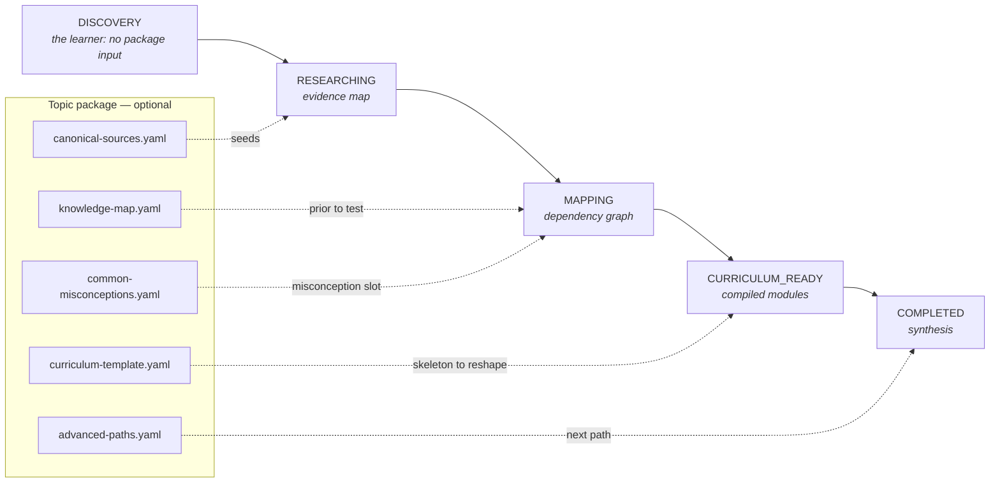

# Deep-dive library

Optional topic packages that accelerate the research and mapping phases of an ÆON Learn journey for subjects someone has already curated.

> [!NOTE]
> **Management summary.** A topic package is curated epistemic scaffolding for one subject: tier-classified sources, a knowledge map, documented misconceptions and, where the curation exists, a curriculum skeleton and deepening paths. A package pre-answers "where is the good evidence, and how does this subject hang together?" — never "what are the lessons?". Your agent loads a package when one exists and researches from scratch when none does; ÆON Learn behaves identically either way. The library holds thirty packages in five groups of six.

**LIB-1** — Topic packages are accelerators and MUST NOT limit ÆON to predefined subjects.

That is the only normative sentence in this directory. Everything else describes what a package contains and how a conforming agent exploits one when it happens to exist.

## Contents

| Section | Type |
|---|---|
| [How a package accelerates a journey](#how-a-package-accelerates-a-journey) | Explanation |
| [Package anatomy](#package-anatomy) | Reference |
| [Package catalogue](#package-catalogue) | Reference |
| [Person lenses](#person-lenses) | Explanation |
| [Contribute a package](#contribute-a-package) | How-to |
| [Related specifications](#related-specifications) | Reference |

## How a package accelerates a journey

A package seeds two phases of the journey, offers a skeleton to a third, supplies the closing recommendation — and leaves discovery untouched, because no package knows the learner.

The diagram uses the states of [the journey state machine](../protocol/state.md). Each package file lands as follows:

1. **DISCOVERY** — unaffected. Discovery is about the learner, and no package knows the learner.
2. **RESEARCHING** — `canonical-sources.yaml` seeds the evidence map with verified starting points instead of a cold search. Live research still runs on top of it: the agent checks links, fills gaps and searches for anything newer than the package. The package `version` and source dates tell the agent how stale the curation may be.
3. **MAPPING** — `knowledge-map.yaml` is a prior to test against research findings, not a substitute for mapping. Items from `common-misconceptions.yaml` land in the knowledge map's misconception slot and later become debunk material in sessions.
4. **CURRICULUM_READY** — `curriculum-template.yaml` offers a proven skeleton; the compiler reshapes it around the discovered learner (duration, depth, formats, goal) rather than serving it verbatim.
5. **COMPLETED** — `advanced-paths.yaml` feeds the recommended next learning path.

For any subject without a package, the agent runs the same phases from scratch. That is the normal case, and LIB-1 exists so it stays normal.

## Package anatomy

A topic package is a directory under `library/` with up to six YAML files. Only the manifest is required; every package in the catalogue carries one.

| File | Required | Purpose |
|---|---|---|
| `manifest.yaml` | yes | Package identity. Required: `id`, `name`, `version`, `domains`, `canonical_sources`, `learning_paths`. Optional: `prerequisites`, plus curation metadata such as `related_packages` and `popular_lenses`. Validates against the [topic-package schema](../schemas/topic-package.schema.json). |
| `canonical-sources.yaml` | no | Tier-classified source entries with URLs to legally accessible editions — the seed of the evidence map defined in [protocol source tiering](../protocol/research.md). |
| `knowledge-map.yaml` | no | Prior knowledge structure: concepts and their dependencies, mental models, key people and schools, historical context, controversies with named counterpositions. Mirrors the structure of the [knowledge mapping phase](../products/learn/knowledge-map.md). |
| `common-misconceptions.yaml` | no | Documented myths with corrections and evidence — feeds the misconception slot of the knowledge map and the boundary step of [sessions](../products/learn/session.md). |
| `curriculum-template.yaml` | no | A sequencing skeleton that survived real use, for the [curriculum compiler](../products/learn/curriculum.md) to adapt — never a fixed course. |
| `advanced-paths.yaml` | no | Deepening paths for the recommended-next-path step at [completion](../products/learn/assessment.md). |

Curated epistemic scaffolding beats fixed prose lessons: a package ships judgement about sources and structure, not finished content. Partial packages are normal — a package carries only the files it can ground in real sources. Today every package in the catalogue carries the first four files, and [`charisma/`](charisma/) is the only one with all six.

### Tiers are calibrated per package, not across the library

Every `canonical-sources.yaml` uses the same four-point scale — 1 primary source, 2 high-quality synthesis, 3 expert interpretation, 4 popular explanation — and the same rule that **tier records genre, not importance**. What differs is the literature each package is scoring. [`distributed-systems/`](distributed-systems/) is the reference calibration; the other technology packages state in their file header how they align to it, and the newer packages carry a `tier_rationale` on every entry giving the one-line reason for the label.

Two consequences follow, and both are deliberate:

- **Tier distributions differ legitimately.** A package whose canon is short primary papers by their own authors ([`information-theory/`](information-theory/)) comes out mostly tier 1. A package whose working vocabulary comes from practitioner books and blogs ([`software-architecture/`](software-architecture/)) comes out mostly tier 3, because that package tiers argue-rather-than-measure work at 3 even when it is famous — Brooks' *No Silver Bullet* included. Neither distribution is a quality signal about the package.
- **Do not filter or rank by tier across packages.** The same rule applied to different corpora produces labels that are not interchangeable: a tier 1 in a mostly-primary package is a much weaker discriminator than a tier 1 in a mostly-secondary one. Cross-package tier comparison is unsupported. Read both file headers first, or use `tier_rationale`, which states the actual judgement rather than a number.

Identifiers follow one rule across the library: **a wrong identifier is worse than none.** A `url` is present only where a canonically stable identifier (DOI, arXiv id, RFC, standards body, author's permanent page) has been checked to resolve to the stated work; entries without one carry the full citation — venue, volume, pages, publisher — in the relevance text. Where a work published in parts has separate records, each part gets its own field. Some packages also carry a `link_check_exceptions` list naming URLs that are correct but that automated checkers report as failures (bot-protection interstitials, incomplete TLS chains, hosts that cannot serve https); those are verified, and a checker result alone is not grounds to remove them.

## Package catalogue

Thirty packages, grouped as the [ÆON Learn invocation surface](https://learn.rapold.io) groups them: six per group. Every entry links to the package directory.

### Economy and money

| Package | What makes it distinctive |
|---|---|
| [`austrian-economics/`](austrian-economics/) | Research package for the canonical invocation subject |
| [`business-cycles/`](business-cycles/) | Competing schools presented as living research programmes, no winner picked |
| [`monetary-history/`](monetary-history/) | Cross-linked with austrian-economics and bitcoin via `related_packages` |
| [`economic-psychology/`](economic-psychology/) | Judgment and decision making, with the replication crisis as a worked example |
| [`investing-and-markets/`](investing-and-markets/) | Built on the Fama–Shiller disagreement; not investment advice |
| [`energy-economics/`](energy-economics/) | Settled physics and contested economics kept apart; deliberately non-partisan |

### Thinking and evidence

| Package | What makes it distinctive |
|---|---|
| [`first-principles-thinking/`](first-principles-thinking/) | Person lens: Elon Musk |
| [`game-theory/`](game-theory/) | Strategic interaction, with John F. Nash Jr. as the biographical entry point |
| [`systems-thinking/`](systems-thinking/) | Feedback, stocks and flows, leverage points |
| [`information-theory/`](information-theory/) | Shannon's own warning against exporting the theory is part of the package |
| [`simulation-hypothesis/`](simulation-hypothesis/) | Philosophy, physics and computation, with the popular-versus-literature gap as a worked example |
| [`law-of-attraction/`](law-of-attraction/) | An unsupported claim taught seriously: history, adjacent science, documented harms |

### Technology and cryptography

| Package | What makes it distinctive |
|---|---|
| [`bitcoin/`](bitcoin/) | Technical primary sources first |
| [`cryptography/`](cryptography/) | Cross-linked with bitcoin, whose primitives it supplies |
| [`distributed-systems/`](distributed-systems/) | The CAP misreading corrected at the source |
| [`software-architecture/`](software-architecture/) | Trade-offs over doctrine, with the empirical strands marked as such |
| [`large-language-models/`](large-language-models/) | Deliberately non-promotional — the protocol runs on these |
| [`quantum-computing/`](quantum-computing/) | Interference, not parallelism; hype separated from machines |

### People and mind

| Package | What makes it distinctive |
|---|---|
| [`charisma/`](charisma/) | Reference package with all six files, grounded in the origin fixture ([Charisma Sprint](../products/learn/examples/charisma/)) and its S1–S26 source base |
| [`negotiation/`](negotiation/) | Research first, practitioner lore labelled |
| [`personality-psychology/`](personality-psychology/) | Person lens: Jordan B. Peterson |
| [`stoicism/`](stoicism/) | Tier 1 primary texts in the public domain |
| [`mindfulness-meditation/`](mindfulness-meditation/) | Person lens: Jay Shetty |
| [`inner-child-work/`](inner-child-work/) | Person lenses: Stefanie Stahl and John Strelecky; carries the recovered-memory lesson |

### Body and habits

| Package | What makes it distinctive |
|---|---|
| [`sleep-science/`](sleep-science/) | Includes the popularisation controversy as a worked example |
| [`nutrition-fundamentals/`](nutrition-fundamentals/) | Teaches how to read the field, not just its conclusions; not medical advice |
| [`strength-training/`](strength-training/) | Evidence base and gym folklore separated; not medical advice |
| [`habit-formation/`](habit-formation/) | The 21-day myth, debunked at the source |
| [`intermittent-fasting/`](intermittent-fasting/) | Trial evidence versus marketing; not medical advice |
| [`creatine/`](creatine/) | Strong performance evidence and weak cognitive claims, tiered apart; not medical advice |

## Person lenses

Some packages carry a `popular_lenses` list in their manifest: public figures through whom many learners first meet a subject — a podcast host, an entrepreneur, a popular author. A lens is framing, not authority. It documents why people arrive and which tier the person's material occupies, so an invocation like "teach me what X teaches" can be accelerated by the underlying subject package while the person's popular work is tiered honestly, usually tier 4, with peer-reviewed collaborations placed higher. Controversies around lens figures follow the same rule as any other controversy: named critiques, no hagiography, no hit piece.

## Contribute a package

Follow these steps in order:

1. Write `manifest.yaml` first and validate it against the [topic-package schema](../schemas/topic-package.schema.json).
2. Cite real sources only, tier-classify each entry per [protocol source tiering](../protocol/research.md), and give working URLs wherever a legally accessible edition exists.
3. Name real counterpositions in the knowledge map's controversies for contested subjects — see [the austrian-economics knowledge map](austrian-economics/knowledge-map.yaml) for the expected depth.
4. Write package content in English; quote source languages only when quoting a fixture or a primary text.
5. Format YAML with 2-space indentation and no tabs.

The wider contribution rules — normative language, versioning, review — are in [the repository contribution guide](../CONTRIBUTING.md).

## Related specifications

| Document | Why you would read it |
|---|---|
| [ÆON Learn specification](../products/learn/specification.md) | The umbrella requirements a package accelerates but never overrides |
| [Journey state machine](../protocol/state.md) | The states the acceleration diagram names |
| [Research and source tiers](../protocol/research.md) | The tiering every `canonical-sources.yaml` entry follows |
| [Topic-package schema](../schemas/topic-package.schema.json) | The machine-readable manifest contract |
| [Schema directory](../schemas/README.md) | How the five schemas relate, and how to validate a package locally |
