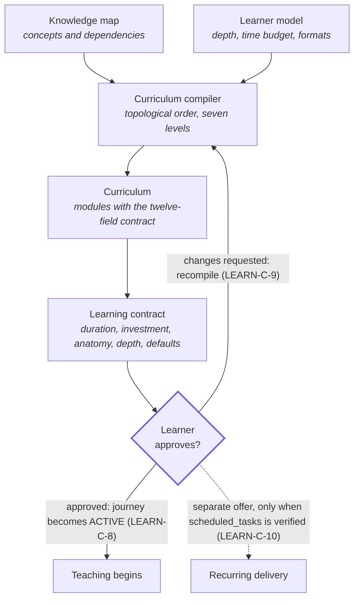

# ÆON Learn — curriculum and learning contract

Governs how the knowledge map becomes a module sequence, and the gate the learner controls before any teaching starts.

> [!NOTE]
> **Management summary.** The curriculum compiler turns the knowledge map into a personalised, dependency-respecting module sequence — seven levels from foundation to synthesis, every module carrying the full twelve-field contract. Before anything is taught, the agent presents a learning contract and waits for explicit approval. Recurring delivery is offered separately, and only when scheduling is genuinely available. This specification refines LEARN-6 and LEARN-7 of [specification.md](specification.md). Requirement IDs: `LEARN-C-n`. Version: ÆON Learn 0.3.0.

The key words MUST, MUST NOT, SHOULD, SHOULD NOT and MAY are to be interpreted as described in RFC 2119 and RFC 8174.

Compilation transitions the journey from `MAPPING` to `CURRICULUM_READY`; learner approval of the contract transitions it to `ACTIVE` ([`../../protocol/state.md`](../../protocol/state.md)).

This reference specifies one phase. For the requirements it refines and its place among the other phases, see the [ÆON Learn specification](specification.md).

## Contents

- [Compiler](#compiler)
- [Module contract](#module-contract)
- [Time budget](#time-budget)
- [Learning contract](#learning-contract)
- [Scheduling offer](#scheduling-offer)
- [Related specifications](#related-specifications)

## Compiler

**Compilation ends at a gate the learner controls: nothing is taught until the contract is approved, and a change request recompiles the curriculum instead of patching it.** The following diagram shows the compiler's two inputs, the gate, and the three paths that leave it.



**LEARN-C-1** — The curriculum MUST be compiled from the knowledge map, not improvised. Each module's `core_concepts` MUST reference knowledge-map nodes, and module order MUST respect the dependency sequencing of LEARN-K-4.

**LEARN-C-2** — The curriculum SHOULD follow the seven-level structure:

```text
Subject
├── Foundation
├── Core mental models
├── Mechanisms
├── Applications
├── Counterarguments
├── Advanced implications
└── Synthesis
```

Short programs MAY merge adjacent levels, but the order MUST be preserved, counterarguments MUST survive compression for contested subjects (LEARN-10), and synthesis closes every program (LEARN-14).

## Module contract

**LEARN-C-3** — Every module MUST carry all twelve fields:

```yaml
id:
title:
learning_objective:    # observable: what the learner can do afterwards
prerequisites:         # earlier module ids, or concepts assumed known per LEARN-K-5
core_concepts:         # knowledge-map node ids
evidence:              # claim ids from the evidence map
counterposition:       # serious counterposition from research
example:               # concrete before abstract
exercise:              # practical, completable within the day
reflection:            # normally three questions
retrieval_question:    # asked in a later session, recall attempted before the answer
estimated_duration:    # minutes
```

An empty `counterposition` is permitted only where the evidence map shows no serious counterposition — "none known" is a researched statement, never a default.

**LEARN-C-4** — Each module's `retrieval_question` SHOULD be scheduled into later sessions for spaced retrieval (LEARN-12, [adaptation.md](adaptation.md)).

**LEARN-C-5** — The curriculum SHOULD serialise per [`../../schemas/curriculum.schema.json`](../../schemas/curriculum.schema.json), so it can be validated, resumed and exchanged between runtimes.

## Time budget

**LEARN-C-6** — Session durations MUST fit the learner model: each session's total SHOULD NOT exceed `daily_time_budget`, and the module count MUST fit `program_duration`. When the knowledge map does not fit the budget, the compiler MUST cut scope — recording the cuts as out of scope per LEARN-K-6 — rather than silently exceed the budget or compress modules beyond comprehensibility.

## Learning contract

**LEARN-C-7** — Before teaching, the agent MUST present the proposed path: program duration, daily investment, session anatomy, research depth, any defaults applied during discovery (LEARN-D-6) and any research limitation (LEARN-R-8). Example presentation (illustrative, not fixed prose):

```text
ÆON has compiled a 14-day learning path.

Daily investment:
~20 minutes

Each session:
5–8 min podcast
8–12 min deep dive
1 concrete example
1 practical exercise
3 reflection questions
retrieval from previous sessions

Research depth:
Advanced
```

**LEARN-C-8** — Teaching MUST NOT begin before the learner explicitly approves the contract. Absence of objection is not approval. Approval transitions the journey to `ACTIVE`.

**LEARN-C-9** — When the learner requests changes (shorter, deeper, different formats), the agent MUST recompile and re-present the contract. Ad-hoc patches that violate prerequisite structure are a protocol violation (LEARN-13).

## Scheduling offer

**LEARN-C-10** — Recurring delivery MUST be offered separately from contract approval, and only when `scheduled_tasks` is verified available (LEARN-2, [`../../protocol/capabilities.md`](../../protocol/capabilities.md)). The agent MUST NOT bundle a scheduling opt-in into the contract approval. When scheduling is unavailable, the agent MUST say so and preserve learner state for on-demand continuation ([`../../protocol/state.md`](../../protocol/state.md)) — claiming scheduling without the capability is a protocol violation (see the [no-scheduling eval](../../evals/learn/cases/eval-03-no-scheduling.yaml)).

## Related specifications

| Specification | Relation |
|---|---|
| [ÆON Learn specification](specification.md) | The umbrella requirements this phase refines (`LEARN-6`, `LEARN-7`) |
| [Knowledge mapping](knowledge-map.md) | The previous phase, which supplies the dependency graph |
| [Session](session.md) | The next phase, which delivers one module per session |
| [Adaptation and retrieval](adaptation.md) | Recompiles the remaining curriculum on repeated signals (`LEARN-A-4`) |
| [Protocol capabilities](../../protocol/capabilities.md) | Gates the scheduling offer (`CAP-8`) |
| [Curriculum schema](../../schemas/curriculum.schema.json) | Machine-readable form of the compiled curriculum |
