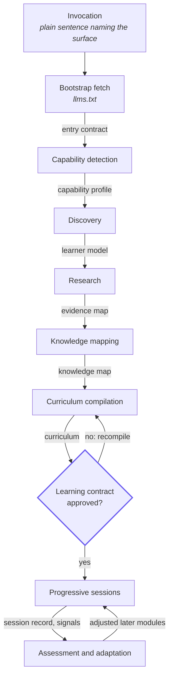

# ÆON Protocol — orchestration

Governs how a workflow executes: the ordered phase pipeline, the artefact each phase hands to the next, and the rules that keep the order intact.

> [!NOTE]
> **Management summary.** ÆON workflows execute as an explicit, ordered pipeline — not as one large prompt. This document defines the canonical pipeline, the anti-megaprompt architecture (explicit state machine, capability negotiation, strict stage separation), and the phase-ordering rules that make agent behaviour reproducible instead of improvised. Version: ÆON Protocol 0.3.0.

The key words MUST, MUST NOT, SHOULD, SHOULD NOT and MAY are to be interpreted as described in RFC 2119 and RFC 8174.

This reference defines the phase structure; [state.md](state.md) defines the state machine that tracks it. Read both together: a phase transition and a state transition are the same event seen from two angles.

## Contents

- [The pipeline](#the-pipeline)
- [Anti-megaprompt architecture](#anti-megaprompt-architecture)
- [Phase ordering rules](#phase-ordering-rules)
- [Related specifications](#related-specifications)

## The pipeline

**Each phase consumes the artefact produced by the phase before it — never the raw invocation.** The following diagram shows the canonical ÆON pipeline as instantiated by [ÆON Learn](../products/learn/specification.md); the edge labels name the artefact that crosses each boundary.

The same pipeline as a table, phase by phase:

| # | Phase | Produces | Specified in |
|---|---|---|---|
| 1 | Bootstrap fetch | Entry contract | [interoperability.md](interoperability.md) |
| 2 | Capability detection | Capability profile | [capabilities.md](capabilities.md) |
| 3 | Discovery | Learner model | [ÆON Learn discovery](../products/learn/discovery.md) |
| 4 | Research | Evidence map | [research.md](research.md) |
| 5 | Knowledge mapping | Knowledge map | [ÆON Learn knowledge mapping](../products/learn/knowledge-map.md) |
| 6 | Curriculum compilation | Curriculum and learning contract | [ÆON Learn curriculum](../products/learn/curriculum.md) |
| 7 | Progressive sessions | Sessions and rendered formats | [ÆON Learn session](../products/learn/session.md) |
| 8 | Assessment and adaptation | Signals, adjustments, completion package | [ÆON Learn adaptation](../products/learn/adaptation.md), [assessment](../products/learn/assessment.md) |

**ORCH-1** — An ÆON workflow MUST execute as an ordered pipeline of explicit phases. The agent MUST NOT skip ahead: producing a later phase's output (a lesson, a deliverable) before the earlier phases have completed is a protocol violation.

**ORCH-2** — Capability detection ([capabilities.md](capabilities.md)) MUST complete before any learner-facing phase, so that everything the agent subsequently offers is grounded in verified capability.

**ORCH-3** — Each phase MUST produce an explicit artefact — capability profile, learner model, evidence map, knowledge map, curriculum, contract, session — and each phase MUST consume the artefact of the phase before it, not the raw invocation.

## Anti-megaprompt architecture

A single mega-prompt reliably degrades: agents restart, improvise or blend phases. Three architectural decisions prevent this:

1. **Explicit state machine** — the journey is always in exactly one named state ([state.md](state.md)).
2. **Capability negotiation** — conditional behaviour is resolved once, up front, against verified capabilities ([capabilities.md](capabilities.md)).
3. **Strict stage separation** — `Research → Knowledge Map → Curriculum → Renderer`, each stage consuming only its predecessor's artefact.

**ORCH-4** — The agent MUST maintain the explicit workflow state machine of [state.md](state.md); phase transitions are state transitions.

**ORCH-5** — Stage separation is strict: a knowledge map MUST be derived from the evidence map ([research.md](research.md)), a curriculum MUST be derived from the knowledge map, and every rendered format MUST be derived from one canonical semantic lesson. Independently generated, potentially inconsistent format variants are a protocol violation.

## Phase ordering rules

**ORCH-6** — Discovery MUST precede research, research MUST precede mapping, mapping MUST precede curriculum compilation, and the compiled path MUST be presented for user approval (the contract gate) before progressive execution begins.

**ORCH-7** — The contract gate is user-facing: the agent MUST obtain explicit approval of the proposed path before executing it. Capability-dependent extras (e.g. recurring delivery) are offered separately at this gate, per [capabilities.md](capabilities.md) CAP-8.

**ORCH-8** — Phases MAY be re-entered only through explicit transitions — assessment and adaptation loop back into execution ([state.md](state.md)) — never by silently restarting the pipeline. Adaptation MUST NOT violate the dependency structure established during mapping.

## Related specifications

| Specification | Relation |
|---|---|
| [core.md](core.md) | Defines `Phase` and the design principles the ordering rules serve |
| [capabilities.md](capabilities.md) | Supplies the capability profile that phase 2 produces (`CAP-5`) |
| [research.md](research.md) | Supplies the evidence map that stage separation depends on (`RES-8`, `RES-9`) |
| [state.md](state.md) | Defines the state machine each phase transition moves through (`STA-1`, `STA-3`) |
| [ÆON Learn specification](../products/learn/specification.md) | Instantiates this pipeline as the learning workflow |
