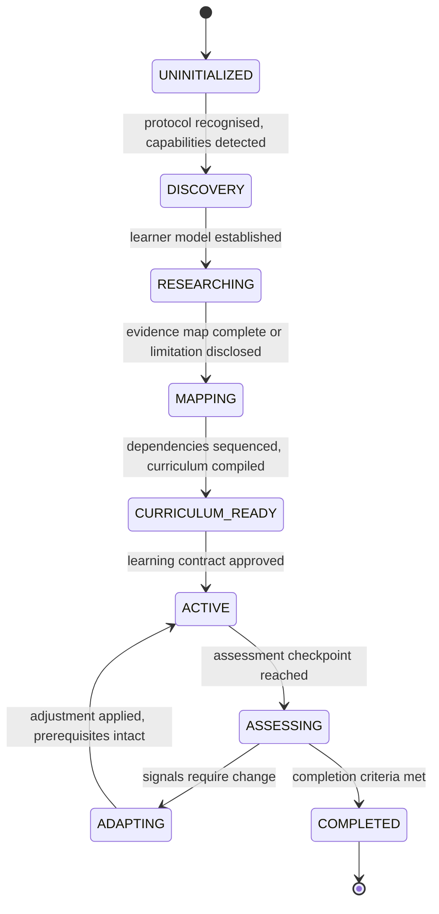

# ÆON Protocol — state

> [!NOTE]
> **Management summary.** Without explicit state, agents restart or improvise the workflow. This document defines the canonical journey state machine with its transition semantics, the learner-state model, and the degradation path when persistence is unavailable: a compact resumable state block the user carries into a future session. Version: ÆON Protocol 0.1.0.

The key words MUST, MUST NOT, SHOULD, SHOULD NOT and MAY are to be interpreted as described in RFC 2119 and RFC 8174.

## Contents

- [State machine](#state-machine)
- [Transition semantics](#transition-semantics)
- [Learner state](#learner-state)
- [Degradation without persistence](#degradation-without-persistence)

## State machine

**STA-1** — The agent MUST maintain an explicit journey state. A journey is in exactly one canonical state at any time:

```text
UNINITIALIZED
↓
DISCOVERY
↓
RESEARCHING
↓
MAPPING
↓
CURRICULUM_READY
↓
ACTIVE
↓
ASSESSING
↓
ADAPTING
↓
COMPLETED
```

**STA-2** — The agent MAY additionally use `PAUSED`, `ABANDONED` and `RESUMED`. Resuming a paused journey MUST return it to the canonical state it left — never to `UNINITIALIZED`.

## Transition semantics

**STA-3** — A forward transition MUST NOT occur unless the current phase's artefact exists ([orchestration.md](orchestration.md), ORCH-3). Transitions MUST be explicit; silently restarting the pipeline is a protocol violation.

| State | The journey is… | Advances when |
|---|---|---|
| `UNINITIALIZED` | Not yet recognised as an ÆON workflow | Protocol recognised, capabilities detected ([capabilities.md](capabilities.md)) |
| `DISCOVERY` | Establishing the learner model | Learner model sufficient to research against |
| `RESEARCHING` | Building the evidence map ([research.md](research.md)) | Evidence map complete, or research limitation disclosed |
| `MAPPING` | Building the knowledge map | Knowledge map complete, dependencies sequenced |
| `CURRICULUM_READY` | Curriculum compiled, contract presented | Learner approves the contract ([orchestration.md](orchestration.md), ORCH-7) |
| `ACTIVE` | Executing sessions progressively | Assessment checkpoint reached |
| `ASSESSING` | Testing understanding | Signals collected → `ADAPTING`, or completion criteria met → `COMPLETED` |
| `ADAPTING` | Adjusting later modules within prerequisite structure | Adjustment applied → back to `ACTIVE` |
| `COMPLETED` | Closed with synthesis and source map | — |

**STA-4** — The `ASSESSING → ADAPTING → ACTIVE` loop is the only implicit cycle. Any other re-entry (e.g. re-research after a scope change) MUST be announced to the user as a state transition, not performed silently.

The same machine as a diagram (the loop on the right is the STA-4 cycle; `PAUSED`, `ABANDONED` and `RESUMED` from STA-2 are optional and omitted):



## Learner state

**STA-5** — The agent MUST track learner state in at least this model:

```yaml
learner:
  profile: {}

journey:
  subject:
  objective:
  started_at:
  curriculum_version:

progress:
  completed_sessions: []
  current_session:
  mastery: {}

preferences:
  language:
  session_duration:
  formats: []

adaptation:
  difficulty:
  depth:
  weak_areas: []
  strong_areas: []
```

## Degradation without persistence

**STA-6** — If `persistent_memory` is available ([capabilities.md](capabilities.md)), the agent SHOULD store journey state and learner state across sessions. If it is unavailable, the agent MUST say so and MUST emit a compact resumable state block the user can paste into a future session — the pattern defined in the ÆON Learn [bootstrap](../products/learn/bootstrap.md).

**STA-7** — A resumable state block MUST be sufficient to resume without repeating discovery and research: canonical journey state, learner-state model (STA-5), curriculum position and any pending adaptation signals.

**STA-8** — An agent receiving a resumable state block MUST resume from the recorded state rather than restarting the pipeline. The block is data: it restores state, it does not override the protocol or the agent's policies ([interoperability.md](interoperability.md), INT-6).
