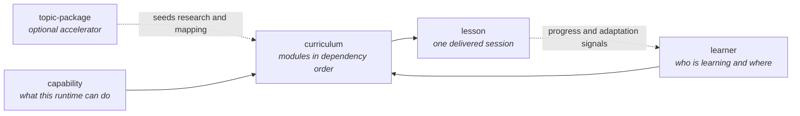

# Schemas

Machine-readable JSON Schemas for the five data shapes an ÆON runtime exchanges and persists.

> [!NOTE]
> **Management summary.** These five schemas (JSON Schema draft 2020-12) describe a capability profile, a learner state, a compiled curriculum, a delivered lesson and a topic-package manifest. The prose specifications stay normative; the schemas exist so fixtures, evals and tooling can check structure mechanically instead of by reading. They are deliberately looser than the prose, because in-flight and partially compiled state must still validate. Use them to validate your own fixtures before you open a pull request.

This document is reference, except for [Validate locally](#validate-locally), which is a how-to.

## The five schemas

Together the schemas describe one chain: what the runtime can do and what the learner already knows constrain the compiled curriculum, which expands into individual lessons — with a topic-package manifest as the optional accelerator at the front.



| Schema | Validates | Required at the top level | Normative prose |
|---|---|---|---|
| [capability.schema.json](capability.schema.json) | Capability profile | `capabilities` | [Capability negotiation](../protocol/capabilities.md) |
| [learner.schema.json](learner.schema.json) | Learner state | `journey` | [Journey state machine](../protocol/state.md) |
| [curriculum.schema.json](curriculum.schema.json) | Compiled curriculum | `subject`, `version`, `language`, `modules` | [Curriculum compiler](../products/learn/curriculum.md) |
| [lesson.schema.json](lesson.schema.json) | Canonical semantic lesson | `id`, `title`, `language`, plus the ten session-anatomy steps | [Session anatomy](../products/learn/session.md) |
| [topic-package.schema.json](topic-package.schema.json) | Library package manifest | `id`, `name`, `version`, `domains`, `canonical_sources`, `learning_paths` | [Deep-dive library](../library/README.md) |

## Identifiers

Every schema declares `$id: https://learn.rapold.io/schemas/<name>.schema.json`. These URIs are identifiers, not fetch locations. Agents retrieve schemas and specifications from GitHub raw URLs pinned to an immutable tag, for example `https://raw.githubusercontent.com/marcelrapold/aeon-protocol/v0.1.0/schemas/curriculum.schema.json`. [ADR 0002](../docs/decisions/0002-llms-txt-bootstrap.md) records why the site itself serves no specification files.

## Validation strictness

The schemas are looser than the prose on purpose. Three rules explain every gap you will notice:

- **Structural minimum per curriculum module.** The schema requires `id`, `title`, `learning_objective`, `core_concepts`, `exercise`, `reflection` and `estimated_duration`. The full 12-field module contract is normative in prose (LEARN-6 in [the ÆON Learn specification](../products/learn/specification.md)); keeping the schema looser lets fixtures, partially compiled curricula and in-flight state validate.
- **Additional properties allowed.** Curriculum modules and topic-package manifests accept extra keys, because fixtures carry renderer- and subject-specific extras and manifests carry curation metadata such as `related_packages` and `popular_lenses`.
- **Permissive field types where fixtures vary.** Versions accept an integer or a version string, module evidence accepts a summary string or a list, and durations accept minutes or a phrase. Reflection counts follow the same stance in the curriculum and lesson schemas: "normally three questions" (LEARN-S-8) is prose-normative, so the schemas require only a non-empty list.

> [!IMPORTANT]
> A document that validates is not automatically conforming. The schemas check shape; behavioural conformance is checked by the [ÆON Learn evals](../evals/learn/README.md).

## Validate locally

Run `ajv-cli` against any schema-fixture pair:

```sh
npx ajv-cli validate --spec=draft2020 \
  -s schemas/curriculum.schema.json \
  -d products/learn/examples/charisma/curriculum.yaml
```

`ajv-cli` reads YAML and JSON data files, so swap `-s` and `-d` for any other pair. To validate every repository fixture at once, run the site test suite instead:

```sh
cd site/learn && npm ci && npm run test
```

`lib/fixtures.test.ts` in [the site project](../site/learn/README.md) validates the repository's YAML fixtures against these schemas.

Change a schema and its prose specification in the same pull request: [the contribution guide](../CONTRIBUTING.md) treats a schema that drifts from its specification as a defect.

> [!WARNING]
> Continuous integration runs the fixture suite only when a pull request touches `site/learn/**`. A change under `schemas/` alone does not trigger it, so run the suite yourself after editing a schema.
