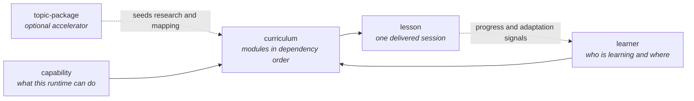

# Schemas

Machine-readable contracts for the data an ÆON runtime exchanges and persists, for the cases that test it, and the rules for changing one.

> [!NOTE]
> **Management summary.** Five JSON Schemas (draft 2020-12) describe the runtime data shapes — a capability profile, a learner state, a compiled curriculum, a canonical lesson and a topic-package manifest — and a sixth describes an eval case. The prose specifications stay normative; the schemas exist so data can be checked mechanically instead of by reading, and so an agent can see from the schema alone what it is expected to emit. Every property carries a description that names the requirement behind it. Read [Where the schemas are strict](#where-the-schemas-are-strict-and-where-they-are-open) before you call a gap a bug, and [Compatibility policy](#compatibility-policy) before you tighten one.

## Contents

| Section | Type |
|---|---|
| [The schemas](#the-schemas) | Reference |
| [Which schema validates which file](#which-schema-validates-which-file) | Reference |
| [How a schema relates to the prose](#how-a-schema-relates-to-the-prose) | Explanation |
| [What the schemas do not check](#what-the-schemas-do-not-check) | Explanation |
| [Where the schemas are strict, and where they are open](#where-the-schemas-are-strict-and-where-they-are-open) | Explanation |
| [Identifiers](#identifiers) | Reference |
| [Validate locally](#validate-locally) | How-to |
| [Compatibility policy](#compatibility-policy) | Reference |

## The schemas

Five schemas describe the data an ÆON runtime produces and consumes, and they form one chain: what the runtime can do and what the learner already knows constrain the compiled curriculum, which expands into individual lessons — with a topic-package manifest as the optional accelerator at the front.



| Schema | Describes | Required at the top level | Normative prose |
|---|---|---|---|
| [capability.schema.json](capability.schema.json) | The verified capability profile of one session | `capabilities`, with all ten canonical keys | [Capability negotiation](../protocol/capabilities.md) (`CAP-1` to `CAP-10`) |
| [learner.schema.json](learner.schema.json) | Learner state, stored or handed over as a resumable block | `journey`, itself requiring `subject` and `state` | [Journey state machine](../protocol/state.md) (`STA-1` to `STA-10`) |
| [curriculum.schema.json](curriculum.schema.json) | A compiled curriculum in dependency order | `subject`, `version`, `language`, `modules` | [Curriculum and learning contract](../products/learn/curriculum.md) (`LEARN-C-n`) |
| [lesson.schema.json](lesson.schema.json) | The canonical semantic lesson every format is derived from | `id`, `title`, `language` and all ten session slots | [Session anatomy](../products/learn/session.md) (`LEARN-S-n`) |
| [topic-package.schema.json](topic-package.schema.json) | A deep-dive library package manifest | `id`, `name`, `version`, `domains`, `canonical_sources`, `learning_paths` | [Deep-dive library](../library/README.md) (`LIB-1`) |

A sixth schema describes the material that tests a runtime rather than anything a runtime emits:

| Schema | Describes | Required at the top level | Normative prose |
|---|---|---|---|
| [eval-case.schema.json](eval-case.schema.json) | One behavioural eval case | `id`, `title`, `invocation`, `simulated_context`, `expected_behaviour`, `fail_conditions`, `pass_criteria` | [Eval cases](../evals/learn/cases/README.md) and [the compliance rubric](../evals/learn/protocol-compliance.md) |

## Which schema validates which file

The repository names data files by convention, and the validation toolchain maps a file to a schema by that name. Name a new file accordingly and it is validated automatically; name it something else and the toolchain reports it as unknown rather than skipping it silently.

| Path pattern | Schema | Instances today |
|---|---|---|
| `library/*/manifest.yaml` | topic-package | every package manifest in the library |
| `**/curriculum.yaml` | curriculum | [the Charisma Sprint curriculum](../products/learn/examples/charisma/curriculum.yaml) |
| `**/lesson.yaml`, `**/lesson-*.yaml` | lesson | none yet |
| `**/learner.yaml`, `**/learner-state.yaml` | learner | none yet |
| `**/capability.yaml`, `**/capability-profile.yaml` | capability | none yet |
| `evals/learn/cases/eval-*.yaml` | eval-case | every behavioural case |
| `simulated_context` inside those cases | capability | the same cases |

An eval case is validated twice, and deliberately so: the whole file against the eval-case schema, and its `simulated_context` against the capability schema, because that block is a capability profile in every respect (`CAP-1`). Validating it once against each keeps the ten-key vocabulary defined in exactly one place.

Two nearby files are deliberately outside this set. The topic-package companion files — `canonical-sources.yaml`, `knowledge-map.yaml`, `common-misconceptions.yaml`, `advanced-paths.yaml` — are specified in prose by [the library README](../library/README.md), and `curriculum-template.yaml` is a sequencing skeleton keyed by package rather than a compiled curriculum, so it carries no `subject` and no `language`. Writing schemas for them would mean inventing contracts the specification does not state.

## How a schema relates to the prose

The prose is the requirement; the schema is the part of it a machine can check.

- **Every description names its requirement.** Read a property's description and you get the intent and the identifier behind it — `boundary` cites `LEARN-S-6`, `state` cites `STA-10`, `label` cites `EPI-1`. That is what makes the schema usable as agent-facing documentation and not just a type declaration.
- **Schemas and specifications move together.** Ground rule 5 of [the contribution guide](../CONTRIBUTING.md): a specification change that touches a field changes the schema in the same pull request. A schema that has drifted from its specification is a defect, whichever side moved.
- **Validating is not conforming.** The schemas check shape. Whether an agent actually discovers before compiling, researches before teaching or states a boundary is behaviour, and behaviour is checked by [the ÆON Learn evals](../evals/learn/README.md).
- **Every example is real.** The `examples` are copied from data in this repository — the Charisma Sprint curriculum, the library manifests, the capability profiles of the eval cases, an evidence entry from [the strength-training knowledge map](../library/strength-training/knowledge-map.yaml). An example that cannot be copied is left out rather than invented, which is why `lesson.schema.json` shows examples slot by slot and none for a whole lesson: the repository contains no lesson written in the canonical anatomy yet.

## What the schemas do not check

JSON Schema validates one document at a time, so these invariants belong to the validation toolchain and to review, not here:

- A package `id` equals its directory name under `library/`.
- A `related_packages` or `prerequisites` entry names a package that exists.
- Module `id` values are unique within a curriculum, and every `prerequisites` entry names an earlier module — the acyclic, topologically ordered graph of `LEARN-K-2` and `LEARN-K-4`.
- A module's `core_concepts` are knowledge-map nodes (`LEARN-C-1`), and its `evidence` entries resolve to claims in the evidence map (`RES-8`).
- A lesson's `module_id` names a module of the curriculum the learner state is following.
- The `sources` of a claim actually support it. No schema can check honesty; that is what the epistemic labels and the evals are for.

## Where the schemas are strict, and where they are open

**Strict where the specification closes a set.** Journey states, epistemic labels, the ten capability keys and the four source tiers are canonical vocabulary that evals match on literally, so they are enums. Identifiers — package ids, learning-path names, module and session ids — are constrained to ASCII patterns, because prose stays in the learner's language while identifiers travel between runtimes. Required lists follow the specification: all ten session slots, all six required manifest fields, ten of the twelve module-contract fields.

**Ten of twelve, and why.** `curriculum.schema.json` requires every module-contract field except `prerequisites` and `retrieval_question`. Those two are optional because the frozen [Charisma Sprint fixture](../products/learn/examples/charisma/curriculum.yaml) predates the protocol and contains neither, a gap recorded in [its retrospective](../products/learn/examples/charisma/retrospective.md). `LEARN-C-3` still requires all twelve in new work: the schema is one field-count short of the specification, on purpose, and says so in the module description.

**Open where the specification does not close.** Top-level objects and curriculum modules accept extra properties. That is not laziness: `LEARN-C-13` states the twelve fields are the minimum and not the maximum, the library manifests carry curation metadata the [library README](../library/README.md) documents (`related_packages`, `popular_lenses`, `description`, `epistemic_core`), and a learner state captured mid-journey legitimately lacks the sections a later phase writes. Every open object carries a `$comment` saying why it is open, so an inherited looseness cannot be mistaken for an oversight.

**Permissive types where real data varies.** A version is an integer or a dotted string, a duration is whole minutes or the phrase the contract states, and a language is a BCP 47 tag or the natural-language name the learner used. Reflection counts follow the same stance: "normally three questions" (`LEARN-S-8`) is prose-normative, so the schemas require a non-empty list.

**Patterns rather than formats.** Dates and identifiers are constrained with `pattern`, not with `format`. `format` is annotation-only in draft 2020-12 and unknown to a bare `ajv` in strict mode, so a `format` keyword would make the plain `ajv-cli` command below reject the schema itself unless every caller loaded a plugin. A pattern asserts everywhere, with no dependency.

## Identifiers

A schema in this directory declares its `$id` as `https://raw.githubusercontent.com/marcelrapold/aeon-protocol/main/schemas/<name>.schema.json` — the host agents already fetch this repository from ([ADR 0002](../docs/decisions/0002-llms-txt-bootstrap.md)), on a path that does not move between releases. Adding a schema means adding one more `$id` in exactly that shape.

The specifications an agent reads at runtime are pinned to an immutable tag, and schema `$id`s deliberately are not. An `$id` is an identity: pin it and every release renames every schema in this directory, breaking any reference to them, while adding a fourth pinned location that [`scripts/bump-version.mjs`](../scripts/bump-version.mjs) does not know about — the silent-drift failure ADR 0002 warns against. Fetch a schema for a specific release the way you fetch a specification for one: swap `main` for the tag you are already pinned to.

## Validate locally

Validate one schema against its data with `ajv-cli`, exactly as [the contribution guide](../CONTRIBUTING.md) does:

```sh
npx ajv-cli validate --spec=draft2020 \
  -s schemas/topic-package.schema.json \
  -d "library/*/manifest.yaml"

npx ajv-cli validate --spec=draft2020 \
  -s schemas/curriculum.schema.json \
  -d products/learn/examples/charisma/curriculum.yaml
```

`ajv-cli` reads YAML and JSON data files, so swap `-s` and `-d` for any other pair. To check that a change you expect to reject really does, invert the assertion:

```sh
npx ajv-cli test --spec=draft2020 \
  -s schemas/lesson.schema.json \
  -d your-broken-lesson.json --invalid
```

To validate every data file in the repository against its mapped schema, run the repository toolchain — the same command continuous integration runs:

```sh
npm ci && npm run validate:schemas
```

The [invocation surface](../site/learn/README.md) additionally validates the repository fixtures from its own test suite, so run that too when you change a schema:

```sh
cd site/learn && npm ci && npm run test
```

## Compatibility policy

Schemas are versioned with the component they belong to — `ÆON Protocol x.y.z` for capability and learner, `ÆON Learn x.y.z` for curriculum, lesson, topic-package and eval-case — under the semantic-versioning rules of [the contribution guide](../CONTRIBUTING.md). A schema edit carries the version impact of the requirement it encodes.

| Change | Impact | Examples |
|---|---|---|
| Data that used to validate no longer does | Major | Adding a `required` entry, closing `additionalProperties`, narrowing a type, tightening a `pattern`, removing an `enum` member, raising `minItems` |
| Producers gain something they may emit | Minor | Adding an optional property, adding an `enum` member, relaxing a constraint, adding a schema |
| Nothing about acceptance changes | Patch | Editing a `title`, `description`, `$comment` or `examples` |

Three rules apply on top of the table:

1. **Prove it against the real data first.** Run every schema against every file it governs before you propose a tightening. A tightening that rejects data in this repository is a finding, not a change: decide whether the data or the specification is wrong, and fix that instead.
2. **A schema never tightens ahead of its prose.** If the schema would reject something the specification permits, the schema is wrong. Change the specification first, in the same pull request, with the requirement identifier and the version impact named.
3. **`$id` values do not change.** Renaming a schema is a breaking change for every document that references it, and there is no deprecation path for a fetched identifier.

Record the change under `Unreleased` in [`CHANGELOG.md`](../CHANGELOG.md), naming the requirement identifiers it encodes.
